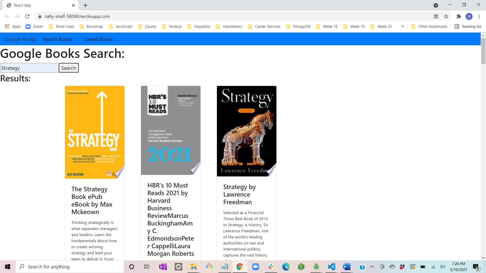

# Google Book Search

#### by: rnick1

### **Table of Contents:**

- [Project Description](#project-description)
- [Installation](#installation)
- [Usage](#usage)
- [License](#license)
- [Contributors](#contributors)

### **Project Description:**

My Google Book Search app is a basic application that is designed to enable a user to search for their favorite books via the google books api. The end product is intended to allow the user to save books they want to read to a list using a mongo database.

### **Installation:**

There will be no installation required as this app is live.

### **Usage:**

After navigating to the webpage, simply type your search criteria into the search box and click "search".

### **License:**

None

### **Contributors:**

rnick1

### **Live Link:**

[Book Search](https://salty-shelf-58098.herokuapp.com/)

### If you have any questions, please contact Nick Rider at: rnick0260@gmail.com
